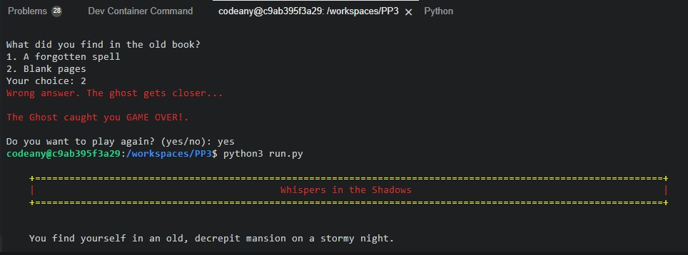

# **Whispers in the Shadows**

Introduction: 
You find yourself standing at the entrance of Ravenscroft Manor, an imposing mansion with a history steeped in mystery and darkness. The air is thick with an otherworldly fog, and the moonlight struggles to penetrate the dense canopy of ancient trees surrounding the estate. The only sound is a haunting whisper that seems to echo through the shadows.

Background: 
Ravenscroft Manor was once a grand residence, home to the enigmatic Ravenscroft family. However, a curse befell the family, and the once-majestic mansion became a place of despair and supernatural phenomena. Whispers of forbidden rituals and ghostly apparitions have haunted the halls for generations.

Inciting Incident: 
Driven by an insatiable curiosity or a need to uncover family secrets, you enter the mansion. As you explore, you discover an old tome hidden in the library containing an incantation that, once spoken, awakens the spirits that dwell within. The mansion transforms into a realm where the living and the dead coexist, and you are caught in the middle.

Objective: 
You must navigate the haunted mansion, making choices that will determine your fate. Each question presents a new challenge, a new encounter with the supernatural. The whispers guide you, but can they be trusted? Will you escape the clutches of the malevolent spirits, or will you become one with the shadows that linger in Ravenscroft Manor?

Try you luck! Welcome to <a href="https://pp3-shadows-99906bed5dee.herokuapp.com/" target="_blank" rel="noopener">Whispers in the Shadows</a>

# Contents

- [**Whispers in the Shadows**](#Rock-Paper-Scissors)  <!-- Fixed anchor link -->
- [Contents](#contents)
- [User Experience](#user-experience)
  - [User Stories](#user-stories)
  - [Flow Chart](#flow-chart)
  - [Site Structure](#site-structure)
  - [Design Choices](#design-choices)
- [Features](#features)
  - [Future Features](#future-features)
- [Technologies Used](#technologies-used)
- [Testing](#testing)
- [Deployment](#deployment)
    - [**To deploy the project**](#to-deploy-the-project)
    - [**To fork the repository on GitHub**](#to-fork-the-repository-on-github)
    - [**To create a local clone of this project**](#to-create-a-local-clone-of-this-project)
- [Credits](#credits)
    - [Content](#content)
- [Acknowledgements](#acknowledgements)

# User Experience

## User Stories

* As a user, I want to be able to start the game.
* As a user, I want to be able to read the rules.
* As a user, I want to play the game.
* As a user, I want to be able to restart the game or quit.

[Back to top](#contents)

## Flow chart

[Back to top](#contents)

## Site Structure

Whispers in the Shadows is a single working Python program.

[Back to top](#contents)

## Design Choices

 * ### Typography
      Whispers in the Shadows has a simple DOS-looking design.
      * I used green color for the right answer.
      * I used red color for the wrong answer and the heading for the program name.
      * I used yellow color for the border.

[Back to top](#contents)

# Features

#### Story Introduction:
* A captivating story introduction that sets the spooky and mysterious atmosphere of the game.
#### Difficulty Levels:
* Three difficulty levels (Easy, Medium, Hard) that influence the number of wrong answers allowed before the ghost catches the player.
#### Question Types:
* Multiple-choice questions with two options, providing players with choices that impact the game's outcome.
#### User Input Handling:
* input validation for user choices to ensure the game responds appropriately to player input.
#### Scoring System:
* A scoring system that tracks the player's correct answers, contributing to the final score.
#### Ghost Catching Mechanic:
* A mechanic where the ghost catches the player if a certain number of wrong answers is reached, based on the chosen difficulty level.
#### Game Over Screen:
* Display of a game-over screen when the ghost catches the player, concluding the game.
#### Game Completion Screen:
* Display of a completion screen when the player successfully answers all questions, indicating that they have escaped the paranormal.
#### Colorama for Color and Style:
* Usage of the Colorama library to add color and style to the text, enhancing the visual appeal of the game.
#### Randomized Questions:
* Questions are randomized, adding variety and replayability to each playthrough.
#### Menu System:
* A menu system that allows the player to read the rules, start the game, or quit.
#### Rules Display:
* Display of game rules that explain the objective, scoring, and consequences of wrong answers.
#### User Interface Formatting:
* Formatting enhancements using ASCII characters to create borders and visually separate different sections of the game.
#### Difficulty Choice:
* Player choice of difficulty level at the beginning of the game, influencing the overall challenge.
#### Delay between Sections:
* Small time delays between certain sections of the game for pacing.
#### Main Game:
* A main game loop that allows players to navigate through the story, make choices, and experience the consequences.
#### Exit:
* A clean exit option when the player decides to quit the game.
#### Error Handling:
* Basic error handling to catch unexpected issues and inform the player.

[Back to top](#contents)

## Future Features 

* Build a website so this game gets more design to it.

[Back to top](#contents)

# Technologies Used
* [Python](https://www.python.org/) - provides the function for the site.
* [GitHub](https://github.com/) - used to host my website.
* [Codeanywhere](https://app.codeanywhere.com) - used to build and edit the program.

[Back to top](#contents)

# Testing

## Code Validation

Whispers in the Shadows program has be tested. All the code has been run through the [CI Python Linter](https://pep8ci.herokuapp.com/#)

The Ci Python Linter results for the program is below:

* Whispers in the shadows

## Browser Compatibility

This program was tested on the following browsers.
Google Chrome, Microsoft Edge and Mozilla Firefox. Appearance and functionality  were consistent.

## Testing User Stories

* As a user, I want to be able to start the game.
  * There is a option to start the game.
     
* As a user, I want to be able to read the rules.
  * There is a option to read the rules.
     
* As a user, I want to se if my answers are right or wrong.
  * As a player you get the color green for right and color red for wrong.
         
* As a user, I want to be able to restart the game or quit.
  * When the game is over you have the option to restart or quit.

## Known Bugs

* During the build. I hade three bugs one where a loop was broken and what ever you answer was wrong.  The other was the lines in the story were to long.  When you answer wrong the program broke.  
    1.
     
    2. 
    
    3. 
     

* ### Resolved

  * Whit the broken loop i hade forgotten a letter, when i put it in all worked fine.

  * With the lines. I checked the spelling and sorted out so the line get over 79.

  * I moved the try inside the While and change print insted of raise. 

    

## Additional Testing

  * There were minor spelling and grammar errors that have since been fixed.

  * I did a color test so i could see that the color were put on the right answer.
  

[Back to top](#contents)

# Deployment

### **To deploy the project**
The site was deployed to Heroku pages. The steps to deploy a site are as follows:
  1. On the Heroku page, click on **New**, then create a new app.
   
  2. Then a new window will pop up. Create a name for the deployment, and change location (Europe in my case). 
   
  3. Then click **Create app**.
  4. Once it's created, you will be sent to the page for deployment.
  5. In the deployment page, you will go to **Settings**.
  6. Once in Settings, you will need to add Vars (If you need.). Then you need to **Add buildpack** and add Heroku/python and Heroku/nodejs. 
   
  7. Back to deployment. You want to use deployment method **GitHub** and connect to your repository. And search for your project.
  8. At last, you can use manual deploy and click **Deploy Branch**. 
  

  The live link to the Heroku repository can be found here - https://dashboard.heroku.com/apps/pp3-shadows  
  The live link to the GitHub repository can be found here - https://github.com/Storkfrasse/PP3

### **To fork the repository on GitHub**
A copy of the GitHub Repository can be made by forking the GitHub account. This copy can be viewed and changes can be made to the copy without affecting the original repository. Take the following steps to fork the repository;
1. Log in to **GitHub** and locate the [repository](https://github.com/Storkfrasse/PP3).
2. On the right-hand side of the page in line with the repository name is a button called **'Fork'**, click on the button to create a copy of the original repository in your GitHub Account.

### **To create a local clone of this project**
The method for cloning a project from GitHub is below:

1. Under the repository’s name, click on the **code** tab.
2. In the **Clone with HTTPS** section, click on the clipboard icon to copy the given URL.
1. Go to [Codeanywhere](https://app.codeanywhere.com) Log in with GitHub
2. Press the **+** New Workspace 
3. Paste the link.
4. Press **enter** and the local clone will be created.

[Back to top](#contents)

# Credits
### Content

* For some of the code I used. [Python crash course](https://www.amazon.se/-/en/Eric-Matthes/dp/1593279280) (By Eric Matthes.)
* The story for the program I used. [ChatGPT](https://chat.openai.com/)

[Back to top](#contents)

# Acknowledgements
The site was completed as a Portfolio 3 Project piece for the Full Stack Software Developer at the [Code Institute](https://codeinstitute.net/). As such, I would like to thank my mentor Rory Patrick Sheridan.

Michael Sjö 2023.

[Back to top](#contents)